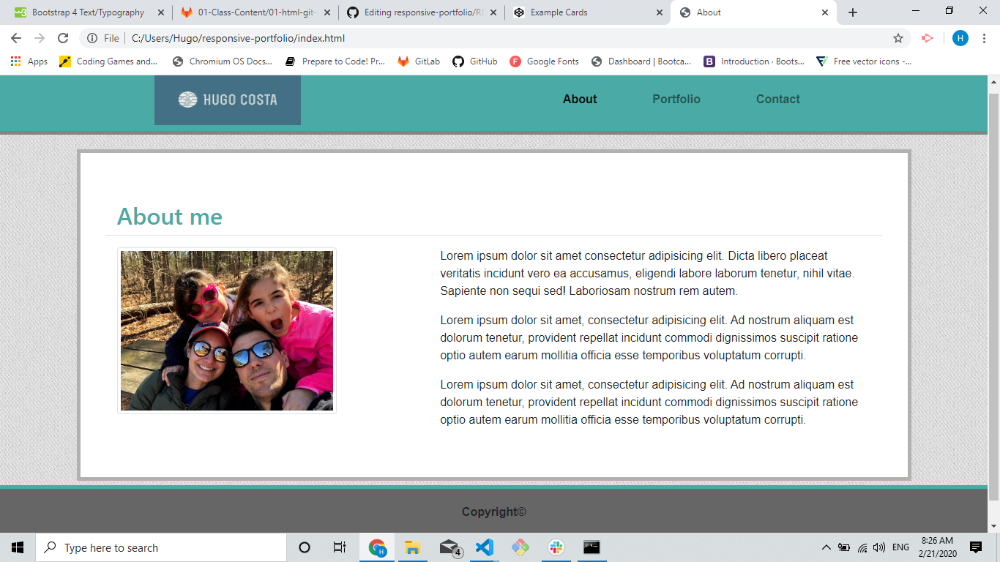

# responsive-portfolio
 
 <!DOCTYPE html>
<html lang="en">

<head>
    <meta charset="UTF-8">
    <meta name="viewport" content="width=device-width, initial-scale=1.0">
    <link rel="stylesheet" href="https://stackpath.bootstrapcdn.com/bootstrap/4.4.1/css/bootstrap.min.css"
        integrity="sha384-Vkoo8x4CGsO3+Hhxv8T/Q5PaXtkKtu6ug5TOeNV6gBiFeWPGFN9MuhOf23Q9Ifjh" crossorigin="anonymous">
        <link rel="stylesheet" href="css/contact.css">
        <link href="https://fonts.googleapis.com/css?family=Coda+Caption:800&display=swap" rel="stylesheet">
    
   
</head>

<body>
<h1>Introduction </h1>

<strong>This is a simple project illustrating the use of Bootstrap to minimize the use of CSS and Media Queries. The Navigation bar on top of the page repeats on all three pages (About Me, Portfolio and Contact).</strong>

<h2>General Info</h2>

The Navigation bar on top of the page repeats on all three pages (About Me, Portfolio and Contact).You can easily navigate throughout the site clicking on each link. In the middle you have a container with information related to that page, and on the bottom you have a fixed footer that was also created using the container class from Bootstrap. The goal is to when the user resizes their screen, the page will automacally resize all of it's components to fit the screen size. Below you can find instructions and screenshots...

<h2>Instructions</h2>
    
        
On a screen size anywhere from 500px to 768px the navigation bar will collapse forming a "Hamburger Menu" and the contents from the page will rearrenge themselves. You can see it below...
    

        
    
</body>
</html>

 